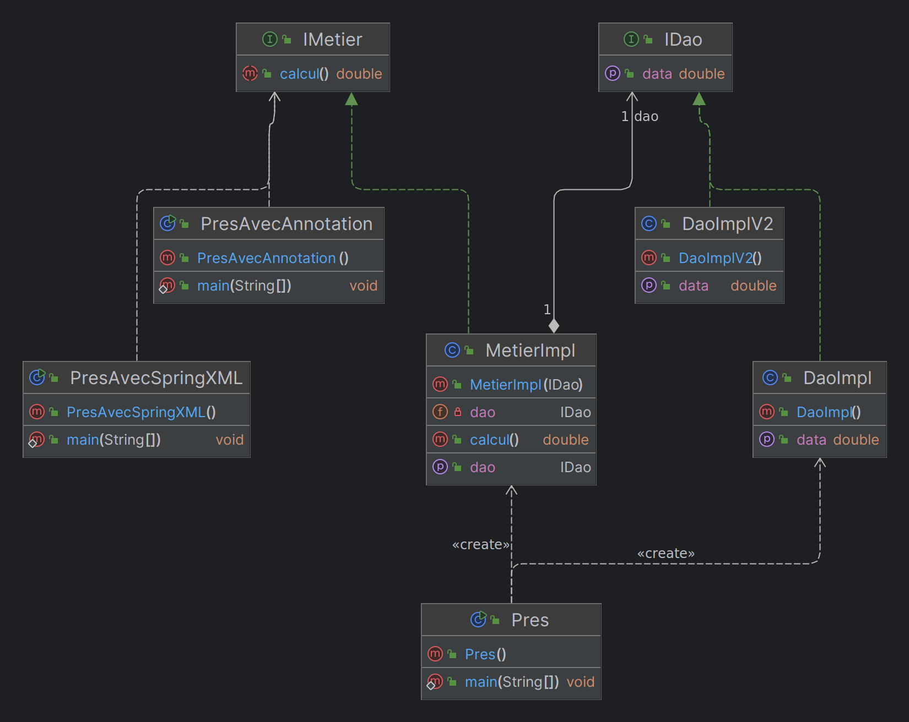

# Spring IoC



This is a simple project to demonstrate the Spring IoC container, using XML configuration and Java annotations.

- `@Component`: This annotation is used to mark a class as a Spring bean. The IoC container will automatically detect and register the bean.
  ```java
    @Component("beanName")
    public class BeanType {
        // Bean code
    }
    ```
- `@Autowired`: This annotation is used to inject a bean into another bean.
    ```java
        @Autowired
        private BeanType bean;
    ```
  If we have:
  - Single Constructor: If your bean class has only one constructor, then starting from Spring 4.3, you can omit `@Autowired`. Spring will automatically use that constructor for dependency injection.
  - Multiple Constructors: If there are multiple constructors, at least one must be annotated with `@Autowired` to clarify which one Spring should use for injection.
- `@Resource`: This annotation is used to inject a bean into another bean. It is similar to `@Autowired`, but it is more powerful and can be used to inject beans by name.
- When we have multiple beans of the same type, we can use the `@Qualifier` annotation to specify which bean we want to inject.
    ```java
    @Autowired
    @Qualifier("beanName")
    private BeanType bean;
    ```
- `@Value`: This annotation is used to inject a value into a bean.
  ```java
  @Value("value")
  private String value;
  ```
- `@Configuration`: This annotation is used to specify a class as a configuration class.
  ```java
    @Configuration
    public class AppConfig {
        @Bean
        public BeanType bean() {
            return new BeanType();
        }
    }
    ```
- `@PostConstruct`: This annotation is used to specify a method that should be executed after the bean has been initialized.
  ```java
    @PostConstruct
    public void init() {
        // Initialization code
    }
  ```
- `@PreDestroy`: This annotation is used to specify a method that should be executed before the bean is destroyed.
    ```java
        @PreDestroy
        public void destroy() {
            // Cleanup code
        }
    ```


